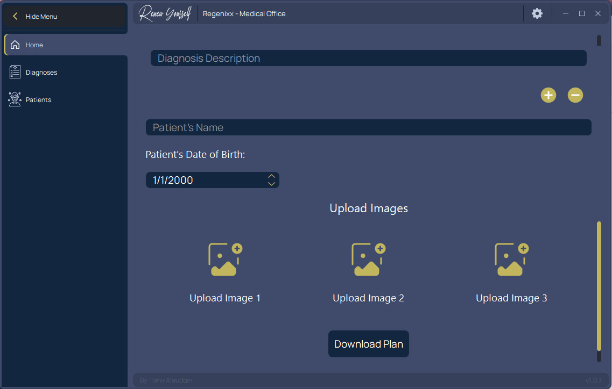

# Regenixx Medical Software


Regenixx is a Python-based medical software designed to automate the creation of personalized PDF brochures for patients, offering them three different plan options: Basic, Standard, or Premium. This user-friendly software utilizes the `PySide6` framework for the frontend, incorporates `QSS` for styling, and employs the `pypdf2` module to handle PDF generation. It features two themes, "Dracula" and a custom theme named "Regenixx," along with various user-centric enhancements, including keyboard shortcuts, hotkeys, animations, and hover effects. Additionally, Regenixx boasts an auto-update mechanism that notifies users of available updates via pop-up messages, with data stored on an AWS S3 Bucket.

## Table of Contents
- [How to Set Up the Software](#how-to-set-up-the-software)
  - [For Simple Users](#for-simple-users)
  - [For Programmers/Developers](#for-programmersdevelopers)
- [Additional Notes](#additional-notes)

## How to Set Up the Software

### For Simple Users

1. Download the MSI installer file.
2. Follow the installation instructions to complete the setup.
3. Enjoy using Regenixx for generating personalized patient brochures!

### For Programmers/Developers

1. Clone or download the source code from the project repository.
2. Install dependencies using pipenv:

   ```bash
   pipenv install
   ```

3. Ensure the existence of a folder named "PDFs" with a template PDF file named "Patient Program PDF Template.pdf" within the project directory. If this folder or file is missing, please create it or add them manually.
4. Create a `.env` file inside the project folder and set the required AWS variables:

   ```plaintext
   AWS_SECRET_KEY=your_secret_key
   AWS_ACCESS_KEY=your_access_key
   ```

5. If you are a developer, make sure to maintain the `version.json` file. Update the version in the `version.json` file whenever you release an update.

## Additional Notes

- Please make sure to keep the `version.json` file up to date if you are a developer, as it is used to manage software versions.
- For any issues or feature requests, please refer to the project's issue tracker or reach out to the maintainers.

Thank you for choosing Regenixx Medical Software!


### Command to create `installer`
    pyinstaller -Fw --onefile --icon=icon.ico --add-data "fonts;fonts" main.py

### Command to create installer for `download_updates`
    pyinstaller -Fw --onefile --icon=icon.ico download_updates.py

Everytime a new update is released, `settings.json` and `version.json` file are always updated

Make sure to include the Environment Variables in the software when deploying the changes


## Preview

